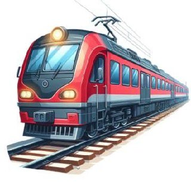

<p align="center">
  
</p>

<h1 align="center">🚆 Masr Train — قطار مصر</h1>

<p align="center">
  <strong>تطبيق حجز تذاكر القطارات المصرية — Egyptian National Railways Booking App</strong>
</p>

<p align="center">
  
  
  
  
  
</p>

<p align="center">
  
  
  
</p>

---

## 📋 نظرة عامة — Overview

**Masr Train (قطار مصر)** هو تطبيق متكامل لحجز تذاكر القطارات المصرية، مبني بتقنية Flutter ومتصل بـ Firebase. يوفر التطبيق تجربة سلسة للمسافرين مع لوحة تحكم كاملة للكومسري (المفتش) لإدارة الرحلات في الوقت الحقيقي.

**Masr Train** is a full-featured Egyptian railway ticket booking app built with Flutter & Firebase. It provides a seamless experience for passengers alongside a real-time conductor dashboard for trip management.

---

## ✨ المميزات الرئيسية — Key Features

### 🎫 للمسافرين (Passenger Features)
| الميزة | الوصف |
|--------|-------|
| 🔐 **تسجيل الدخول والتسجيل** | مصادقة آمنة عبر Firebase Auth مع التحقق من صحة البيانات |
| 🚂 **البحث عن القطارات** | بحث ذكي بين 63+ محطة مع فلترة حسب النوع والوقت |
| 💺 **اختيار المقاعد** | واجهة تفاعلية لاختيار المقعد والدرجة (أولى / ثانية / ثالثة) |
| 💳 **الدفع الإلكتروني** | دعم بطاقات الائتمان مع التحقق بخوارزمية Luhn + محفظة إلكترونية + دفع نقدي |
| 🎟️ **التذكرة الإلكترونية** | تذكرة رقمية مع QR Code فريد لكل حجز |
| 🗺️ **تتبع الرحلة** | خريطة تفاعلية (OpenStreetMap) مع عرض خط السير والموقع الحالي |
| 🔔 **الإشعارات الفورية** | إشعارات لحظية عبر Firebase Cloud Messaging + إشعارات محلية |
| 📊 **جداول القطارات** | عرض شامل لجميع مواعيد القطارات مع تفاصيل المحطات والأسعار |
| 👤 **الملف الشخصي** | إدارة البيانات الشخصية وتعديلها |
| ⭐ **تقييم التطبيق** | واجهة تقييم التطبيق ومشاركة الملاحظات |
| ❓ **المساعدة والدعم** | صفحة مساعدة شاملة مع الأسئلة الشائعة |

### 🎛️ للكومسري / المدير (Conductor & Admin Features)
| الميزة | الوصف |
|--------|-------|
| 🚆 **اختيار القطار** | واجهة بحث متقدمة لاختيار القطار المراد إدارته |
| 📋 **لوحة التحكم** | dashboard شامل لعرض إحصائيات التذاكر والركاب في الوقت الحقيقي |
| 📱 **مسح QR Code** | ماسح QR مدمج للتحقق من صحة التذاكر فوراً |
| ✏️ **إصدار تذاكر** | إصدار تذاكر جديدة للركاب مباشرة من التطبيق |
| 📝 **محاضر المخالفات** | إنشاء وإدارة تقارير الشغب والمخالفات |
| 🔄 **إدارة حالة القطارات** | تحديث حالة القطار (يعمل / متأخر / ملغي / عطل) مع إخطار المسافرين |
| 👥 **إدارة الركاب** | تسجيل صعود ونزول الركاب من القطار |

---

## 🏗️ هيكل المشروع — Project Structure

```
lib/
├── main.dart                          # نقطة الدخول وتهيئة Firebase
├── models/
│   └── models.dart                    # جميع النماذج (User, Train, Booking, Station...)
├── screens/
│   ├── login_screen.dart              # شاشة تسجيل الدخول
│   ├── register_screen.dart           # شاشة إنشاء حساب جديد
│   ├── home_screen.dart               # الشاشة الرئيسية مع التنقل السفلي
│   ├── booking_tab.dart               # تبويب البحث والحجز
│   ├── train_list_screen.dart         # عرض نتائج البحث عن القطارات
│   ├── train_booking_screen.dart      # اختيار المقعد والدرجة
│   ├── payment_screen.dart            # إتمام عملية الدفع
│   ├── ticket_screen.dart             # عرض التذكرة مع QR Code
│   ├── track_screen.dart              # تتبع الرحلة على الخريطة
│   ├── profile_screen.dart            # الملف الشخصي والإعدادات
│   ├── notifications_screen.dart      # عرض الإشعارات
│   ├── all_trains_schedule_screen.dart # جداول جميع القطارات
│   ├── help_screen.dart               # صفحة المساعدة
│   ├── privacy_screen.dart            # سياسة الخصوصية
│   ├── rate_app_screen.dart           # تقييم التطبيق
│   ├── train_selection_screen.dart    # اختيار القطار (الكومسري)
│   ├── conductor_dashboard.dart       # لوحة تحكم الكومسري
│   ├── admin_screen.dart              # لوحة تحكم المدير
│   ├── qr_scanner_screen.dart         # ماسح QR Code
│   ├── issue_ticket_screen.dart       # إصدار تذاكر جديدة
│   ├── incident_report_screen.dart    # محاضر المخالفات
│   └── train_status_manager_screen.dart # إدارة حالة القطارات
├── services/
│   ├── app_state.dart                 # إدارة الحالة (Provider + Firebase)
│   ├── train_manager_service.dart     # خدمة إدارة حالة القطارات
│   └── notification_helper.dart       # إدارة الإشعارات المحلية
├── theme/
│   └── app_theme.dart                 # نظام الألوان والتصميم (Dark/Light)
└── widgets/
    └── common_widgets.dart            # مكونات واجهة مشتركة قابلة لإعادة الاستخدام
```

---

## 🛠️ التقنيات المستخدمة — Tech Stack

<table>
  <tr>
    <td align="center" width="120"><br><b>Flutter</b></td>
    <td align="center" width="120"><br><b>Dart</b></td>
    <td align="center" width="120"><br><b>Firebase</b></td>
    <td align="center" width="120"><br><b>Google Maps</b></td>
  </tr>
</table>

| التقنية | الاستخدام | الإصدار |
|---------|-----------|---------|
| **Flutter** | إطار العمل الرئيسي | 3.0+ |
| **Firebase Auth** | المصادقة وإدارة المستخدمين | ^5.6.1 |
| **Cloud Firestore** | قاعدة البيانات اللحظية | ^5.6.10 |
| **Firebase Messaging** | الإشعارات الفورية (FCM) | ^15.2.10 |
| **Provider** | إدارة الحالة | ^6.1.5 |
| **Flutter Map** | خرائط تفاعلية (OpenStreetMap) | ^7.0.2 |
| **Google Maps Flutter** | خرائط Google | ^2.14.2 |
| **QR Flutter** | توليد QR Code | ^4.1.0 |
| **Mobile Scanner** | مسح QR Code بالكاميرا | ^5.2.3 |
| **Google Fonts** | خطوط (Cairo) | ^6.2.1 |
| **Flutter Local Notifications** | إشعارات محلية | ^19.5.0 |
| **URL Launcher** | فتح روابط خارجية | ^6.3.2 |

---

## 🚀 التشغيل — Getting Started

### المتطلبات الأساسية (Prerequisites)

- Flutter SDK `>=3.0.0 <4.0.0`
- Dart SDK `>=3.0.0`
- Android Studio / VS Code
- حساب Firebase مع مشروع مُعد

### خطوات التثبيت (Installation)

```bash
# 1. استنساخ المشروع
git clone https://github.com/AhmedAbeed/trainapp.git

# 2. الانتقال إلى مجلد المشروع
cd trainapp

# 3. تثبيت التبعيات
flutter pub get

# 4. تشغيل التطبيق
flutter run
```

### إعداد Firebase

1. أنشئ مشروع جديد في [Firebase Console](https://console.firebase.google.com)
2. أضف تطبيق Android/iOS
3. قم بتحميل ملف `google-services.json` (Android) أو `GoogleService-Info.plist` (iOS)
4. فعّل **Authentication** (Email/Password)
5. فعّل **Cloud Firestore**
6. فعّل **Cloud Messaging**

---

## 🗄️ بنية قاعدة البيانات — Database Schema

```
Firestore Collections:
│
├── 📁 users/
│   └── {userId}
│       ├── name: string
│       ├── email: string
│       ├── phone: string
│       ├── role: "user"
│       └── createdAt: timestamp
│
├── 📁 bookings/
│   └── {bookingId}
│       ├── bookingId: string
│       ├── ticketNumber: string
│       ├── passengerName: string
│       ├── trainNumber: string
│       ├── trainName: string
│       ├── from: string
│       ├── to: string
│       ├── departureTime: string
│       ├── arrivalTime: string
│       ├── date: string
│       ├── seatClass: string
│       ├── seatNumber: int
│       ├── price: int
│       ├── status: "valid" | "scanned" | "invalid"
│       ├── userId: string
│       ├── stops: array<string>
│       └── createdAt: timestamp
│
├── 📁 notifications/
│   └── {notificationId}
│       ├── userId: string
│       ├── title: string
│       ├── body: string
│       ├── type: string
│       ├── read: boolean
│       └── createdAt: timestamp
│
└── 📁 train_statuses/
    └── {trainNumber}
        ├── trainNumber: string
        ├── status: "running" | "delayed" | "cancelled" | "accident"
        ├── reason: string
        ├── delayMinutes: int
        └── updatedAt: timestamp
```

---

## 🚂 القطارات المتاحة — Available Trains

التطبيق يتضمن بيانات **25+ قطار** يغطي الخطوط الرئيسية:

| الخط | عدد القطارات | أمثلة |
|------|-------------|-------|
| 🔴 القاهرة ↔ الإسكندرية | 14 قطار | خاص، روسي، مكيف، نوم، تالجو |
| 🟢 القاهرة ↔ أسوان | 6 قطارات | روسي، مكيف روسي، خاص |
| 🔵 القاهرة ↔ أسيوط | 1 قطار | روسي |
| 🟡 القاهرة ↔ بنها | 1 قطار | روسي |
| 🟠 المنصورة ↔ الإسكندرية | 6 قطارات | مكيف روسي |

**63 محطة** تغطي مصر من الشمال إلى الجنوب.

---

## 🌍 الدعم اللغوي — Language Support

التطبيق يدعم لغتين بالكامل مع تبديل فوري:

- 🇪🇬 **العربية** (الافتراضية) — واجهة RTL كاملة
- 🇬🇧 **English** — Full LTR interface

---

## 🎨 التصميم — Design System

| الوضع | الخلفية | السطح الأساسي | اللون الرئيسي |
|-------|---------|--------------|--------------|
| 🌙 **Dark Mode** | `#0B0B0C` | `#1C1C1E` | `#E52E36` |
| ☀️ **Light Mode** | `#F5F5F5` | `#FFFFFF` | `#E52E36` |

**ألوان الحالة:**
- 🟢 نجاح: `#00B884`
- 🟡 تحذير: `#FFB800`
- 🔵 معلومات: `#00A8E8`
- 🔴 خطأ/رئيسي: `#E52E36`

---

## 👨‍💻 المطور — Developer

<p align="center">
  <a href="https://github.com/AhmedAbeed">
    
  </a>
</p>

**Ahmed Abed** — Flutter Developer

---

## 📄 الرخصة — License

هذا المشروع مرخص تحت رخصة MIT — راجع ملف [LICENSE](LICENSE) للتفاصيل.

---

<p align="center">
  صُنع بـ ❤️ في مصر 🇪🇬
  <br>
  <strong>Made with ❤️ in Egypt 🇪🇬</strong>
</p>
