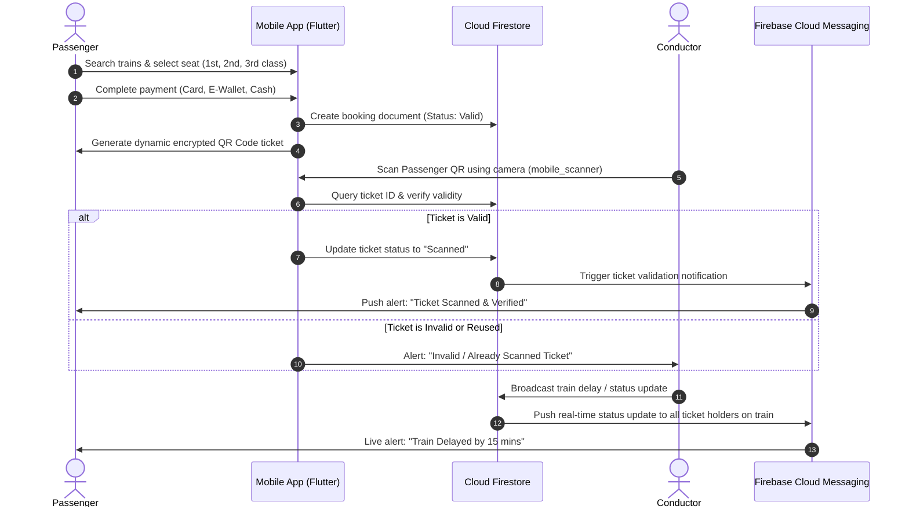
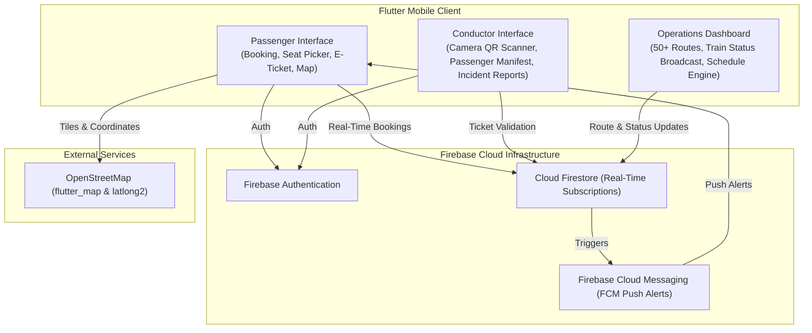

# Masr Train: Egyptian Railways Booking & Live Tracking System

A full-featured mobile ticketing and operations management system for the **Egyptian National Railways (ENR)**, built with **Flutter** and **Firebase**.


---

## Contactless QR Ticketing & Tracking Workflow

The system coordinates passenger booking, conductor validation, and live notifications through real-time Firestore listeners and Firebase Cloud Messaging (FCM).


```mermaid
sequenceDiagram
    autonumber
    actor Passenger
    participant App as Mobile App (Flutter)
    participant DB as Cloud Firestore
    actor Conductor
    participant FCM as Firebase Cloud Messaging

    Passenger->>App: Search trains & select seat (1st, 2nd, 3rd class)
    Passenger->>App: Complete payment (Card, E-Wallet, Cash)
    App->>DB: Create booking document (Status: Valid)
    App->>Passenger: Generate dynamic encrypted QR Code ticket

    Conductor->>App: Scan Passenger QR using camera (mobile_scanner)
    App->>DB: Query ticket ID & verify validity
    alt Ticket is Valid
        App->>DB: Update ticket status to "Scanned"
        DB->>FCM: Trigger ticket validation notification
        FCM->>Passenger: Push alert: "Ticket Scanned & Verified"
    else Ticket is Invalid or Reused
        App->>Conductor: Alert: "Invalid / Already Scanned Ticket"
    end

    Conductor->>DB: Broadcast train delay / status update
    DB->>FCM: Push real-time status update to all ticket holders on train
    FCM->>Passenger: Live alert: "Train Delayed by 15 mins"
```

---

## System Architecture


```mermaid
graph TD
    subgraph Client ["Flutter Mobile Client"]
        PASS["Passenger Interface<br/>(Booking, Seat Picker, E-Ticket, Map)"]
        COND["Conductor Interface<br/>(Camera QR Scanner, Passenger Manifest, Incident Reports)"]
        ADMIN["Operations Dashboard<br/>(50+ Routes, Train Status Broadcast, Schedule Engine)"]
    end

    subgraph Firebase ["Firebase Cloud Infrastructure"]
        AUTH["Firebase Authentication"]
        FIRESTORE["Cloud Firestore (Real-Time Subscriptions)"]
        MESSAGING["Firebase Cloud Messaging (FCM Push Alerts)"]
    end

    subgraph External ["External Services"]
        MAPS["OpenStreetMap (flutter_map & latlong2)"]
    end

    PASS -->|"Auth"| AUTH
    COND -->|"Auth"| AUTH
    PASS -->|"Real-Time Bookings"| FIRESTORE
    COND -->|"Ticket Validation"| FIRESTORE
    ADMIN -->|"Route & Status Updates"| FIRESTORE
    FIRESTORE -->|"Triggers"| MESSAGING
    MESSAGING -->|"Push Alerts"| PASS
    PASS -->|"Tiles & Coordinates"| MAPS
```

---

## Features

### Passenger Features
- **Authentication**: Multi-method login/signup with Firebase Auth.
- **Route Search Engine**: Search schedules across **63 stations** covering all major Egyptian railway lines.
- **Interactive Seat Selection**: Real-time seat reservation across 1st, 2nd, and 3rd class cabins.
- **Contactless E-Tickets**: Secure QR code generation with dynamic ticket states (Valid, Scanned, Expired).
- **Live Trip Tracking**: Real-time GPS and map visualization powered by OpenStreetMap (`flutter_map`).
- **Push Notification Engine**: Instant alerts for ticket validation, platform changes, and route delays.
- **Bilingual Support**: Comprehensive Arabic (RTL, Cairo font) and English (LTR) with dark/light themes.

### Conductor & Station Admin Features
- **Live Train Manifest**: Instant synchronized passenger list for any selected train route.
- **High-Speed QR Scanner**: Camera-based barcode/QR scanner (`mobile_scanner`) with sub-second validation.
- **On-the-Spot Issuance**: Issue emergency or replacement tickets directly onboard.
- **Operational Status Manager**: Update live train status (Running, Delayed, Cancelled, Breakdown) triggering automatic passenger notifications.
- **Incident Reporting**: Digital logging of operational infractions and ticket violations.

---

## Tech Stack

| Layer | Library / Service | Purpose |
|:---|:---|:---|
| **Framework** | Flutter 3.x & Dart | Native Android & iOS cross-platform client |
| **State Management** | `provider` | Reactive application state & Firestore listener bindings |
| **Authentication** | `firebase_auth` | Secure identity management |
| **Database** | Cloud Firestore | Real-time database for 25+ trains, schedules, and active bookings |
| **Push Notifications**| `firebase_messaging`, `flutter_local_notifications` | Background & foreground alert delivery |
| **Mapping & GIS** | `flutter_map`, `latlong2` | Interactive vector map without proprietary API fees |
| **Barcode / QR** | `qr_flutter`, `mobile_scanner` | Ticket generation and camera-based verification |
| **Typography** | `google_fonts` (Cairo) | Optimized Arabic typography |

---

## Database Architecture (Firestore)

The Firestore database is structured into four primary collections:

- **`users`**: User profiles, roles (Passenger, Conductor, Admin), contact details, and account metadata.
- **`bookings`**: `ticketNumber`, `passengerName`, `trainNumber`, `from`, `to`, `departureTime`, `arrivalTime`, `seatClass`, `seatNumber`, `price`, `status` (`valid`, `scanned`, `invalid`), `userId`, `stops[]`.
- **`notifications`**: Targeted user alerts, timestamps, read receipts, and alert categories.
- **`train_statuses`**: `trainNumber`, `status` (`running`, `delayed`, `cancelled`), `delayMinutes`, and operational reason.

---

## Train Coverage

The platform integrates complete timetable and station data for **25+ trains** across key Egyptian lines:
- **Cairo ⟷ Alexandria**: Special, Russian, VIP, AC, Sleeper, and Talgo services (14 trains).
- **Cairo ⟷ Aswan**: Upper Egypt express and sleeper lines (6 trains).
- **Cairo ⟷ Asyut / Banha**: Regional transit routes.
- **Mansoura ⟷ Alexandria**: Delta transit lines (6 trains).
- **Network Scope**: 63 stations connecting Alexandria in the north to Aswan in the south.

---

## Getting Started

### Prerequisites
- Flutter SDK (^3.0.0 or higher)
- Dart SDK
- Configured Firebase project with Auth, Firestore, and Cloud Messaging enabled.

```bash
git clone https://github.com/AhmedAbeed/trainapp.git
cd trainapp
flutter pub get
flutter run
```

*Note: Supply your own `google-services.json` (Android) or `GoogleService-Info.plist` (iOS) from your Firebase Console.*

---

## License

This project is licensed under the [MIT License](LICENSE).
